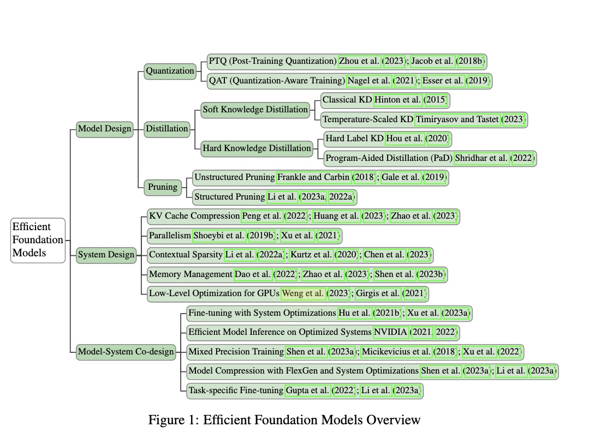

<<<<<<< HEAD
# Survey on Efficient Large Foundation Model: A Perspective From Model and System Co-Design
=======
# Survey on Efficient Large Foundation Models: A Perspective From Model and System Co-Design
>>>>>>> 5502c44b3ff33f6726ba33633c4e6a0cb1ed4f35

## Paper Link: https://arxiv.org/abs/2409.01990

## Efficient Foundation Models Overview

1. [Model Design](#model-design)
    - [Quantization](#quantization)
    - [Distillation](#distillation)
    - [Pruning](#pruning)
2. [System Design](#system-design)
    - [K-V Cache](#k-v-cache)
    - [Token Sparsification](#token-sparsification)
    - [Efficient Cache Eviction](#efficient-cache-eviction)
    - [Memory Management](#memory-management)
    - [Efficient Retrieval Augmented Models](#efficient-retrieval-augmented-models)
    - [Efficient Transformers Architecture Design](#efficient-transformer-architecture-design)
3. [Model-Sys Co-Design](#model-sys-co-design)
    - [Mixed Precision Training](#mixed-precision-training)
    - [Mixture of Expert](#moe)
    - [Fine-Tuning with System Optimization](#fine-tuning-with-system-optimization)
    - 

## Model Design

### Quantization

| Article Title                                                                                                                 | Year | Subfield     | Link                                     |
| ----------------------------------------------------------------------------------------------------------------------------- | ---- | ------------ | ---------------------------------------- |
| **Quarot: Outlier-free 4-bit inference in rotated LLMs**                                                                      | 2024 | Quantization | [Link](https://arxiv.org/abs/2404.00456) |
| **Sparse-quantized representation for near-lossless LLM weight compression**                                                  | 2023 | Quantization | [Link](https://arxiv.org/abs/2306.03078) |
| **GPTQ: Accurate post-training quantization for generative pre-trained transformers**                                         | 2022 | Quantization | [Link](https://arxiv.org/abs/2210.17323) |
| **Llama.int8(): 8-bit matrix multiplication for transformers at scale**                                                       | 2022 | Quantization | [Link](https://arxiv.org/abs/2205.14135) |
| **Llm-qat: Data-free quantization aware training for large language models**                                                  | 2023 | Quantization | [Link](https://arxiv.org/abs/2305.17888) |
| **Bitdistiller: Unleashing the potential of sub-4-bit llms via self-distillation**                                            | 2024 | Quantization | [Link](https://arxiv.org/abs/2402.10631) |
| **OneBit: Towards Extremely Low-bit Large Language Models**                                                                   | 2024 | Quantization | [Link](https://arxiv.org/abs/2402.11295) |
| **QLoRA: efficient finetuning of quantized LLMs**                                                                             | 2023 | Quantization | [Link](https://arxiv.org/abs/2305.14314) |
| **Memory-efficient fine-tuning of compressed large language models via sub-4-bit integer quantization**                       | 2023 | Quantization | [Link](https://arxiv.org/abs/2305.14152) |
| **Loftq: Lora-fine-tuning-aware quantization for large language models**                                                      | 2023 | Quantization | [Link](https://arxiv.org/abs/2310.08659) |
| **L4q: Parameter efficient quantization-aware training on large language models via lora-wise lsq**                           | 2024 | Quantization | [Link](https://arxiv.org/abs/2402.04902) |
| **Qa-lora: Quantization-aware low-rank adaptation of large language models**                                                  | 2023 | Quantization | [Link](https://arxiv.org/abs/2309.14717) |
| **Efficientqat: Efficient quantization-aware training for large language models**                                             | 2024 | Quantization | [Link](https://arxiv.org/abs/2407.11062) |
| **Accurate lora-finetuning quantization of llms via information retention**                                                   | 2024 | Quantization | [Link](https://arxiv.org/abs/2402.05445) |
| **EdgeQAT: Entropy and Distribution Guided Quantization-Aware Training for the Acceleration of Lightweight LLMs on the Edge** | 2024 | Quantization | [Link](https://arxiv.org/abs/2402.10787) |

### Distillation

| Article Title                                                                                                              | Year | Subfield               | Link                                                |
| -------------------------------------------------------------------------------------------------------------------------- | ---- | ---------------------- | --------------------------------------------------- |
| **On-policy distillation of language models: Learning from self-generated mistakes**                                       | 2024 | Knowledge Distillation | [Link](https://openreview.net/forum?id=OdnNBxlShZG) |
| **Knowledge distillation for closed-source language models**                                                               | 2024 | Knowledge Distillation | [Link](https://arxiv.org/abs/2401.07013)            |
| **Flamingo: A visual language model for few-shot learning**                                                                | 2022 | Knowledge Distillation | [Link](https://arxiv.org/abs/2204.14198)            |
| **In-context learning distillation: Transferring few-shot learning ability of pre-trained language models**                | 2022 | Knowledge Distillation | [Link](https://arxiv.org/abs/2212.10670)            |
| **Less is more: Task-aware layer-wise distillation for language model compression**                                        | 2022 | Knowledge Distillation | [Link](https://arxiv.org/abs/2210.01351)            |
| **Knowledge Distillation for Closed-Source Language Models**                                                               | 2024 | Knowledge Distillation | [Link](https://openreview.net/pdf?id=oj4KUNoKnf)    |
| **MiniLLM: Knowledge distillation of large language models**                                                               | 2024 | Knowledge Distillation | [Link](https://arxiv.org/pdf/2306.08543)            |
| **Baby llama: knowledge distillation from an ensemble of teachers trained on a small dataset with no performance penalty** | 2023 | Knowledge Distillation | [Link](https://arxiv.org/pdf/2308.02019)            |
| **Propagating knowledge updates to lms through distillation**                                                              | 2023 | Knowledge Distillation | [Link](https://arxiv.org/pdf/2306.09306)            |
| **On-policy distillation of language models: Learning from self-generated mistakes**                                       | 2024 | Knowledge Distillation | [Link](https://arxiv.org/pdf/2306.13649)            |
| **Metaicl: Learning to learn in context**                                                                                  | 2022 | Knowledge Distillation | [Link](https://arxiv.org/pdf/2110.15943)            |
| **In-context learning distillation: Transferring few-shot learning ability of pre-trained language models**                | 2022 | Knowledge Distillation | [Link](https://arxiv.org/pdf/2212.10670)            |
| **Multistage collaborative knowledge distillation from a large language model for semi-supervised sequence generation**    | 2024 | Knowledge Distillation | [Link](https://arxiv.org/pdf/2311.08640)            |
| **Minillm: Knowledge distillation of large language models**                                                               | 2024 | Knowledge Distillation | [Link](https://openreview.net/forum?id=OdnNBxlShZG) |
| **Layer-wise Knowledge Distillation for BERT Fine-Tuning**                                              | 2022 | Knowledge Distillation      | [Link](https://arxiv.org/abs/2204.05155)                             |

### Pruning

| Article Title                                                                                                           | Year | Subfield                   | Link                                                 |
| ----------------------------------------------------------------------------------------------------------------------- | ---- | -------------------------- | ---------------------------------------------------- |
| **SparseGPT: Massive language models can be accurately pruned in one-shot**                                             | 2023 | Unstructured; Saliency     | [Link](https://arxiv.org/abs/2303.12712)             |
| **A simple and effective pruning approach for large language models**                                                   | 2023 | Unstructured; Saliency     | [Link](https://arxiv.org/abs/2306.11695)             |
| **One-shot sensitivity-aware mixed sparsity pruning for large language models**                                         | 2024 | Unstructured; Saliency     | [Link](https://arxiv.org/abs/2310.09499)             |
| **Pruning as a Domain-specific LLM Extractor**                                                                          | 2024 | Unstructured; Saliency     | [Link](https://arxiv.org/abs/2405.06275)             |
| **Plug-and-play: An efficient post-training pruning method for large language models**                                  | 2024 | Unstructured; Saliency     | [Link](https://openreview.net/forum?id=Tr0lPx9woF)   |
| **Pruner-Zero: Evolving Symbolic Pruning Metric from scratch for Large Language Models**                                | 2024 | Unstructured; Saliency     | [Link](https://arxiv.org/abs/2406.02924)             |
| **Prune and tune: Improving efficient pruning techniques for massive language models**                                  | 2023 | Unstructured; Saliency     | [Link](https://openreview.net/forum?id=cKlgcx7nSZ)   |
| **Language-Specific Pruning for Efficient Reduction of Large Language Models**                                          | 2024 | Unstructured; Saliency     | [Link](https://aclanthology.org/2024.unlp-1.16.pdf)  |
| **Besa: Pruning large language models with blockwise parameter-efficient sparsity allocation**                          | 2024 | Unstructured; Optimization | [Link](https://arxiv.org/abs/2402.16880)             |
| **LLM-Pruner: On the structural pruning of large language models**                                                      | 2023 | Structured; Saliency       | [Link](https://arxiv.org/abs/2305.11627)             |
| **Fluctuation-based adaptive structured pruning for large language models**                                             | 2024 | Structured; Saliency       | [Link](https://arxiv.org/abs/2312.11983)             |
| **Structured Pruning for Large Language Models Using Coupled Components Elimination and Minor Fine-tuning**             | 2024 | Structured; Saliency       | [Link](https://openreview.net/forum?id=riVdVAhCRazh) |
| **Sheared llama: Accelerating language model pre-training via structured pruning**                                      | 2023 | Structured; Optimization   | [Link](https://arxiv.org/abs/2310.06694)             |
| **NASH: A Simple Unified Framework of Structured Pruning for Accelerating Encoder-Decoder Language Models**             | 2023 | Structured                 | [Link](https://arxiv.org/abs/2310.10054)             |
| **Light-PEFT: Lightening Parameter-Efficient Fine-Tuning via Early Pruning**                                            | 2024 | Structured; PEFT           | [Link](https://arxiv.org/abs/2406.03792)             |
| **LoRAPrune: Structured Pruning Meets Low-Rank Parameter-Efficient Fine-Tuning**                                        | 2024 | Structured; PEFT           | [Link](https://arxiv.org/abs/2305.18403)             |
| **Flash-llm: Enabling cost-effective and highly-efficient large generative model inference with unstructured sparsity** | 2023 | Infrastructure             | [Link](https://arxiv.org/abs/2309.10285)             |

## System Design

### K-V Cache

| Article Title                                                                                                   | Year | Subfield                                          | Link                                     |
| --------------------------------------------------------------------------------------------------------------- | ---- | ------------------------------------------------- | ---------------------------------------- |
| **PyramidKV: Dynamic KV cache compression based on pyramidal information funneling**                            | 2024 | KV Cache Compression                              | [Link](https://arxiv.org/abs/2406.02069) |
| **Quest: Query-aware sparsity for long-context transformers**                                                   | 2024 | KV Cache Compression                              | [Link](https://arxiv.org/abs/2401.07013) |
| **ZipVL: Efficient Large Vision-Language Models with Dynamic Token Sparsification and KV Cache Compression**    | 2024 | KV Cache Compression                              | [Link](https://arxiv.org/abs/2410.08584) |
| **VL-Cache: Sparsity and Modality-Aware KV Cache Compression for Vision-Language Model Inference Acceleration** | 2024 | KV Cache Compression                              | [Link](https://arxiv.org/abs/2410.23317) |
| **Token merging: Your ViT but faster**                                                                          | 2023 | Cache Eviction                                    | [Link](http://arxiv.org/abs/2210.09461)  |
| **KV Cache is 1 Bit Per Channel: Efficient Large Language Model Inference with Coupled Quantization**           | 2024 | KV Cache Compression, Quantization                | [Link](https://arxiv.org/abs/2405.03917) |
| **Layer-Condensed KV Cache for Efficient Inference of Large Language Models**                                   | 2024 | KV Cache Optimization, Memory Efficiency          | [Link](https://arxiv.org/abs/2405.10637) |
| **InfiniGen: Efficient Generative Inference of Large Language Models with Dynamic KV Cache Management**         | 2024 | Dynamic KV Cache Management, Long-Text Generation | [Link](https://arxiv.org/abs/2406.19707) |
| **KVSharer: Efficient Inference via Layer-Wise Dissimilar KV Cache Sharing**                                    | 2024 | KV Cache Sharing, Memory Optimization             | [Link](https://arxiv.org/abs/2410.18517) |
| **MiniCache: KV Cache Compression in Depth Dimension for Large Language Models**                                | 2024 | KV Cache Compression, Depth Dimension             | [Link](https://arxiv.org/abs/2405.14366) |
| **Unifying KV Cache Compression for Large Language Models with LeanKV**                                         | 2024 | KV Cache Compression, Unified Framework           | [Link](https://arxiv.org/abs/2412.03131) |
| **Efficient LLM Inference with I/O-Aware Partial KV Cache Offloading**                                          | 2024 | KV Cache Offloading, I/O Optimization             | [Link](https://arxiv.org/abs/2411.17089) |
| **LayerKV: Optimizing Large Language Model Serving with Layer-wise KV Cache Offloading**                        | 2024 | KV Cache Offloading, Serving Optimization         | [Link](https://arxiv.org/abs/2410.00428) |
| **A Method for Building Large Language Models with Predefined KV Cache Capacity**                               | 2024 | KV Cache Management, Predefined Capacity          | [Link](https://arxiv.org/abs/2411.15785) |
| **D2O: Dynamic Discriminative Operations for Efficient Generative Inference of Large Language Models**          | 2024 | Dynamic Operations, KV Cache Optimization         | [Link](https://arxiv.org/abs/2406.13035) |

### Token Sparsification

| Article Title                                                                                 | Year | Subfield                                    | Link                                                                                                                    |
| --------------------------------------------------------------------------------------------- | ---- | ------------------------------------------- | ----------------------------------------------------------------------------------------------------------------------- |
| **DynamicViT: Efficient Vision Transformers with Dynamic Token Sparsification**               | 2021 | Dynamic Token Sparsification                | [Link](https://arxiv.org/abs/2104.04482)                                                                                |
| **A-ViT: Adaptive Tokens for Efficient Vision Transformer**                                   | 2022 | Adaptive Tokens                             | [Link](https://arxiv.org/abs/2206.02696)                                                                                |
| **Quest: Query-Aware Sparsity for Long-Context Transformers**                                 | 2024 | Query-Aware Sparsity                        | [Link](https://arxiv.org/abs/2401.07013)                                                                                |
| **Token-Level Transformer Pruning**                                                           | 2022 | Token Pruning                               | [Link](https://arxiv.org/abs/2203.03229)                                                                                |
| **Token Merging: Your ViT but Faster**                                                        | 2023 | Token Merging                               | [Link](http://arxiv.org/abs/2210.09461)                                                                                 |
| **LazyLLM: Dynamic Token Pruning for Efficient Long Context LLM Inference**                   | 2024 | Dynamic Token Pruning                       | [Link](https://arxiv.org/abs/2407.14057)                                                                                |
| **Q-Hitter: A Better Token Oracle for Efficient LLM Inference via Sparse-Quantized KV Cache** | 2024 | Token Oracle, Sparse-Quantized KV Cache     | [Link](https://proceedings.mlsys.org/paper_files/paper/2024/file/bbb7506579431a85861a05fff048d3e1-Paper-Conference.pdf) |
| **Video Token Sparsification for Efficient Multimodal LLMs in Autonomous Driving**            | 2024 | Video Token Sparsification, Multimodal LLMs | [Link](https://arxiv.org/abs/2409.11182)                                                                                |
| **Efficient Token Sparsification Through the Lens of Infused Knowledge**                      | 2024 | Token Sparsification, Infused Knowledge     | [Link](https://ieeexplore.ieee.org/document/10706518)                                                                   |
| **Tandem Transformers for Inference Efficient LLMs**                                          | 2024 | Tandem Transformers, Inference Efficiency   | [Link](https://arxiv.org/abs/2402.08644)                                                                                |
| **CHESS: Optimizing LLM Inference via Channel-Wise Activation Sparsification**                | 2024 | Activation Sparsification, LLM Optimization | [Link](https://arxiv.org/abs/2409.01366)                                                                                |
| **FlightLLM: Efficient Large Language Model Inference with a Complete Compression Strategy**  | 2024 | Compression Strategy, LLM Inference         | [Link](https://arxiv.org/abs/2401.03868)                                                                                |
| **Sparse Expansion and Neuronal Disentanglement**                                             | 2024 | Sparse Expansion, Neuronal Disentanglement  | [Link](https://arxiv.org/abs/2405.15756)                                                                                |
| **Efficient LLM Inference using Dynamic Input Pruning and Activation Sparsity**               | 2024 | Input Pruning, Activation Sparsity          | [Link](https://arxiv.org/abs/2412.01380)                                                                                |
| **Sparsity for Efficient LLM Inference**                                                      | 2024 | Sparsity Techniques, LLM Efficiency         | [Link](https://llm-class.github.io/slides/Kai_Sheng_Tai.pdf)                                                            |

### Efficient Cache Eviction

| Article Title                                                                                          | Year | Subfield                                   | Link                                                                        |
| ------------------------------------------------------------------------------------------------------ | ---- | ------------------------------------------ | --------------------------------------------------------------------------- |
| **HashEvict: A Pre-Attention KV Cache Eviction Strategy using Locality-Sensitive Hashing**             | 2024 | Cache Eviction, Locality-Sensitive Hashing | [Link](https://arxiv.org/abs/2412.16187)                                    |
| **Ada-KV: Optimizing KV Cache Eviction by Adaptive Budget Allocation for Efficient LLM Inference**     | 2024 | Adaptive Budget Allocation, Cache Eviction | [Link](https://arxiv.org/abs/2407.11550)                                    |
| **NACL: A General and Effective KV Cache Eviction Framework for LLMs at Inference Time**               | 2024 | General Framework, Cache Management        | [Link](https://arxiv.org/abs/2408.03675)                                    |
| **In-context KV-Cache Eviction for LLMs via Attention-Gate**                                           | 2024 | Attention-Gate, Dynamic Cache Eviction     | [Link](https://arxiv.org/abs/2410.12876)                                    |
| **Layer-Condensed KV Cache for Efficient Inference of Large Language Models**                          | 2024 | Layer Compression, Memory Efficiency       | [Link](https://faculty.sist.shanghaitech.edu.cn/faculty/tukw/acl24lckv.pdf) |
| **D2O: Dynamic Discriminative Operations for Efficient Generative Inference of Large Language Models** | 2024 | Dynamic Operations, KV Cache Optimization  | [Link](https://arxiv.org/abs/2406.13035)                                    |
| **H₂O: Heavy-Hitter Oracle for Efficient Generative Inference of Large Language Models**               | 2023 | Heavy-Hitter Tokens, Cache Efficiency      | [Link](https://arxiv.org/abs/2306.14048)                                    |

### Memory Management

| Article Title                                                                                                | Year | Subfield                                          | Link                                                                  |
| ------------------------------------------------------------------------------------------------------------ | ---- | ------------------------------------------------- | --------------------------------------------------------------------- |
| **FlashAttention: Fast and memory-efficient exact attention with I/O-awareness**                             | 2022 | Cache Eviction                                    | [Link](https://arxiv.org/abs/2205.14135)                              |
| **ZipVL: Efficient large vision-language models with dynamic token sparsification and KV cache compression** | 2024 | Memory Management                                 | [Link](https://arxiv.org/abs/2410.08584)                              |
| **Memory use of GPT-J 6B**                                                                                   | 2021 | Memory Management                                 | [Link](https://discuss.huggingface.co/t/memory-use-of-gpt-j-6b/10078) |
| **An Evolved Universal Transformer Memory**                                                                  | 2024 | Neural Attention Memory Models                    | [Link](https://arxiv.org/abs/2410.13166)                              |
| **Efficient Memory Management for Large Language Model Serving with PagedAttention**                         | 2023 | PagedAttention                                    | [Link](https://arxiv.org/abs/2309.06180)                              |
| **Recurrent Memory Transformer**                                                                             | 2023 | Recurrent Memory, Long Context Processing         | [Link](https://github.com/booydar/recurrent-memory-transformer)       |
| **SwiftTransformer: High Performance Transformer Implementation in C++**                                     | 2023 | Model Parallelism, FlashAttention, PagedAttention | [Link](https://github.com/LLMServe/SwiftTransformer)                  |
| **ChronoFormer: Memory-Efficient Transformer for Time Series Analysis**                                      | 2024 | Memory Efficiency, Time Series Data               | [Link](https://github.com/kyegomez/ChronoFormer)                      |

### Efficient Retrieval-Augmented Models

| Article Title                                                                                     | Year | Subfield                                      | Link                                                      |
| ------------------------------------------------------------------------------------------------- | ---- | --------------------------------------------- | --------------------------------------------------------- |
| **REALM: Retrieval-Augmented Language Model Pre-Training**                                        | 2020 | Retrieval-Augmented Models                    | [Link](https://arxiv.org/abs/2002.08909)                  |
| **Retrieval-Augmented Generation for Knowledge-Intensive NLP Tasks**                              | 2020 | Retrieval-Augmented Models                    | [Link](https://arxiv.org/abs/2005.11401)                  |
| **BTR: Binary Token Representations for Efficient Retrieval Augmented Language Models**           | 2023 | Model Efficiency, Token Compression           | [Link](https://arxiv.org/abs/2310.01329)                  |
| **FlashBack: Efficient Retrieval-Augmented Language Modeling for Long Context Inference**         | 2024 | Long Context Inference, Model Efficiency      | [Link](https://arxiv.org/abs/2405.04065)                  |
| **REPLUG: Retrieval-Augmented Black-Box Language Models**                                         | 2023 | Black-Box Models, Retrieval Integration       | [Link](https://arxiv.org/abs/2301.12652)                  |
| **KG-Retriever: Efficient Knowledge Indexing for Retrieval-Augmented Large Language Models**      | 2024 | Knowledge Indexing, Large Language Models     | [Link](https://arxiv.org/abs/2412.05547)                  |
| **Open-RAG: Enhanced Retrieval Augmented Reasoning with Open-Source Large Language Models**       | 2024 | Open-Source Models, Reasoning Enhancement     | [Link](https://aclanthology.org/2024.findings-emnlp.831/) |
| **ERAGent: Enhancing Retrieval-Augmented Language Models with Improved Retrieval and Generation** | 2024 | Retrieval Improvement, Generation Enhancement | [Link](https://arxiv.org/abs/2405.06683)                  |
| **RETA-LLM: A Retrieval-Augmented Large Language Model Toolkit**                                  | 2023 | Toolkit, Model Integration                    | [Link](https://arxiv.org/abs/2306.05212)                  |
| **Making Retrieval-Augmented Language Models Robust to Irrelevant Documents**                     | 2023 | Model Robustness, Document Relevance          | [Link](https://arxiv.org/abs/2310.01558)                  |

### Efficient Transformer Architecture Design

| Article Title                                                                                           | Year | Subfield                       | Link                                                                                                 |
| ------------------------------------------------------------------------------------------------------- | ---- | ------------------------------ | ---------------------------------------------------------------------------------------------------- |
| **Roformer: Enhanced Transformer with Rotary Position Embedding**                                       | 2021 | Positional Embedding           | [Link](https://arxiv.org/abs/2104.09864)                                                             |
| **Analyzing Multi-Head Self-Attention: Specialized Heads Do the Heavy Lifting, the Rest Can Be Pruned** | 2019 | Self-Attention Analysis        | [Link](https://arxiv.org/abs/1904.02813)                                                             |
| **Sixteen Heads Are Better Than One: Attention Mechanisms in Transformers**                             | 2019 | Multi-Head Attention           | [Link](https://arxiv.org/abs/1907.00263)                                                             |
| **TinyFormer: Efficient Transformer Design and Deployment on Tiny Devices**                             | 2023 | Tiny Devices, NAS              | [Link](https://arxiv.org/abs/2311.01759)                                                             |
| **Efficient Transformers: A Survey**                                                                    | 2020 | Transformer Survey, Efficiency | [Link](https://arxiv.org/abs/2009.06732)                                                             |
| **Neural Architecture Search on Efficient Transformers and Beyond**                                     | 2022 | NAS, Transformer Optimization  | [Link](https://arxiv.org/abs/2207.13955)                                                             |
| **TurboViT: Generating Fast Vision Transformers via Generative Architecture Search**                    | 2023 | Vision Transformers, GAS       | [Link](https://arxiv.org/abs/2308.11421)                                                             |
| **HAT: Hardware-Aware Transformers for Efficient Natural Language Processing**                          | 2020 | Hardware-Aware Design, NLP     | [Link](https://arxiv.org/abs/2005.14187)                                                             |
| **Linformer: Self-Attention with Linear Complexity**                                                    | 2020 | Attention Mechanisms           | [Link](https://arxiv.org/abs/2006.04768)                                                             |
| **BigBird: Transformers for Longer Sequences**                                                          | 2020 | Long-Sequence Transformers     | [Link](https://arxiv.org/abs/2007.14062)                                                             |
| **SegFormer: Simple and Efficient Design for Semantic Segmentation with Transformers**                  | 2021 | Semantic Segmentation          | [Link](https://proceedings.neurips.cc/paper/2021/file/64f1f27bf1b4ec22924fd0acb550c235-Paper.pdf)    |
| **MixFormerV2: Efficient Fully Transformer Tracking**                                                   | 2023 | Object Tracking                | [Link](https://papers.neurips.cc/paper_files/paper/2023/file/b7870bd43b2d133a1ed95582ae5d82a4-Paper) |
| **Sparse-pruning for accelerating transformer models**                                                  | 2023 | Pruning and Optimization    | [Link](https://arxiv.org/abs/2305.14135)                             |

## Model-Sys Co-Design

### MoE

| Article Title                                                                                     | Year | Subfield                               | Link                                                                                  |
| ------------------------------------------------------------------------------------------------- | ---- | -------------------------------------- | ------------------------------------------------------------------------------------- |
| **Mixtral of Experts**                                                                            | 2024 | Sparse MoE, Routing Networks           | [Link](https://arxiv.org/abs/2401.04088)                                              |
| **Time-MoE: Billion-Scale Time Series Foundation Models with Mixture of Experts**                 | 2024 | Time Series, Large-Scale Models        | [Link](https://arxiv.org/abs/2409.16040)                                              |
| **AdaMV-MoE: Adaptive Multi-Task Vision Mixture-of-Experts**                                      | 2024 | Vision, Multi-Task Learning            | [Link](https://paperswithcode.com/paper/adamv-moe-adaptive-multi-task-vision-mixture) |
| **DeepSeek-VL2: Mixture-of-Experts Vision-Language Models for Advanced Multimodal Understanding** | 2024 | Vision-Language, Multimodal Models     | [Link](https://arxiv.org/abs/2412.10302)                                              |
| **Uni-MoE: Scaling Unified Multimodal LLMs with Mixture of Experts**                              | 2024 | Multimodal LLMs, Unified Models        | [Link](https://paperswithcode.com/paper/uni-moe-scaling-unified-multimodal-llms-with) |
| **DeepSeekMoE: Towards Ultimate Expert Specialization in Mixture-of-Experts Language Models**     | 2024 | Language Models, Expert Specialization | [Link](https://arxiv.org/abs/2401.06066)                                              |
| **OLMoE: Open Mixture-of-Experts Language Models**                                                | 2024 | Language Models, Open-Source MoE       | [Link](https://openreview.net/forum?id=xXTkbTBmqq)                                    |
| **MH-MoE: Multi-Head Mixture-of-Experts**                                                         | 2024 | Multi-Head Attention, MoE              | [Link](https://arxiv.org/abs/2411.16205)                                              |
| **Mixture of LoRA Experts**                                                                       | 2024 | Parameter-Efficient Fine-Tuning, MoE   | [Link](https://openreview.net/forum?id=uWvKBCYh4S)                                    |
| **From Sparse to Soft Mixtures of Experts**                                                       | 2024 | Soft MoE, Differentiable Routing       | [Link](https://openreview.net/forum?id=jxpsAj7ltE)                                    |
| **A Survey on Mixture of Experts**                                                                | 2024 | Survey, MoE Architectures              | [Link](https://arxiv.org/abs/2407.06204)                                              |

### Mixed Precision Training

| Article Title                                                                                             | Year | Subfield                                        | Link                                     |
| --------------------------------------------------------------------------------------------------------- | ---- | ----------------------------------------------- | ---------------------------------------- |
| **Power-BERT: Accelerating BERT inference via progressive word-vector elimination**                       | 2020 | Mixed Precision                                 | [Link](https://arxiv.org/abs/2005.12345) |
| **Learning both weights and connections for efficient neural network**                                    | 2015 | Mixed Precision                                 | [Link](https://arxiv.org/abs/1803.03635) |
| **Mixed Precision Training**                                                                              | 2018 | Training Optimization                           | [Link](https://arxiv.org/abs/1710.03740) |
| **Mixed Precision Training of Convolutional Neural Networks using Integer Operations**                    | 2018 | Integer Operations, CNNs                        | [Link](https://arxiv.org/abs/1802.00930) |
| **Highly Scalable Deep Learning Training System with Mixed-Precision: Training ImageNet in Four Minutes** | 2018 | Scalability, Training Systems                   | [Link](https://arxiv.org/abs/1807.11205) |
| **Guaranteed Approximation Bounds for Mixed-Precision Neural Operators**                                  | 2023 | Neural Operators, Approximation Theory          | [Link](https://arxiv.org/abs/2307.15034) |
| **Training with Mixed-Precision Floating-Point Assignments**                                              | 2023 | Floating-Point Precision, Training Algorithms   | [Link](https://arxiv.org/abs/2301.13464) |
| **Mixed-precision deep learning based on computational memory**                                           | 2020 | Computational Memory, Model Efficiency          | [Link](https://arxiv.org/abs/2001.11773) |
| **No Token Left Behind: Reliable KV Cache Compression via Importance-Aware Mixed Precision Quantization** | 2024 | Cache Compression, Mixed Precision Quantization | [Link](https://arxiv.org/abs/2402.18096) |

### Fine-Tuning with System Optimization

| Article Title                                                                                           | Year | Subfield                    | Link                                                                 |
| ------------------------------------------------------------------------------------------------------- | ---- | --------------------------- | -------------------------------------------------------------------- |
| **Effective methods for improving interpretability in reinforcement learning models**                   | 2021 | Fine-Tuning                 | [Link](https://link.springer.com/article/10.1007/s10462-021-09984-x) |
| **Efficient Fine-Tuning and Compression of Large Language Models with Low-Rank Adaptation and Pruning** | 2023 | Fine-Tuning and Compression | [Link](https://arxiv.org/abs/2302.08582)                             |
| **Light-PEFT: Lightening parameter-efficient fine-tuning via early pruning**                            | 2024 | Fine-Tuning                 | [Link](https://arxiv.org/abs/2406.03792)                             |
| **Prefix-Tuning: Optimizing Continuous Prompts for Generation**                                         | 2021 | Prompt Optimization         | [Link](https://arxiv.org/abs/2101.00190)                             |
| **P-Tuning v2: Prompt Tuning Can Be Comparable to Fine-Tuning Universally Across Scales and Tasks**     | 2021 | Prompt Tuning               | [Link](https://arxiv.org/abs/2110.07602)                             |
| **Parameter-Efficient Fine-Tuning of Large-Scale Pre-Trained Language Models**                          | 2021 | Parameter-Efficient Tuning  | [Link](https://arxiv.org/abs/2104.08440)                             |
| **Scaling Sparse Fine-Tuning to Large Language Models**                                                 | 2024 | Sparse Fine-Tuning          | [Link](https://arxiv.org/abs/2401.05024)                             |
| **Full Parameter Fine-Tuning for Large Language Models with Limited Resources**                         | 2023 | Resource-Constrained Fine-Tuning | [Link](https://arxiv.org/abs/2306.09782)                             |
| **LISA: Layerwise Importance Sampling for Memory-Efficient Large Language Model Fine-Tuning**           | 2024 | Memory-Efficient Fine-Tuning | [Link](https://arxiv.org/abs/2403.17919)                             |

### Efficient Pretraining
### Efficient Pretraining

| Article Title                                                                                           | Year | Subfield                    | Link                                                                 |
| ------------------------------------------------------------------------------------------------------- | ---- | --------------------------- | -------------------------------------------------------------------- |
| **Efficient Continual Pre-training for Building Domain Specific Large Language Models**                 | 2024 | Continual Pretraining       | [Link](https://arxiv.org/abs/2311.08545)                             |
| **GQKVA: Efficient Pre-training of Transformers by Grouping Queries, Keys, and Values**                 | 2024 | Model Optimization          | [Link](https://arxiv.org/abs/2311.03426)                             |
| **Towards Effective and Efficient Continual Pre-training of Large Language Models**                     | 2024 | Continual Pretraining       | [Link](https://arxiv.org/abs/2407.18743)                             |
| **A Survey on Efficient Training of Transformers**                                                      | 2023 | Training Optimization       | [Link](https://arxiv.org/abs/2302.01107)                             |
| **Jetfire: Efficient and Accurate Transformer Pretraining with INT8 Data Flow and Per-Block Quantization** | 2024 | Quantization Techniques     | [Link](https://arxiv.org/abs/2403.12422)                             |
| **Efficient Pre-training Objectives for Transformers**                                                  | 2021 | Pretraining Objectives      | [Link](https://arxiv.org/abs/2104.09694)                             |
| **MixMAE: Mixed and Masked Autoencoder for Efficient Pretraining of Hierarchical Vision Transformers**  | 2022 | Vision Transformers         | [Link](https://arxiv.org/abs/2205.13137)                             |
| **METRO: Efficient Denoising Pretraining of Large Scale Autoencoding Language Models with Model Generated Signals** | 2022 | Denoising Pretraining       | [Link](https://arxiv.org/abs/2204.06644)                             |
| **Bucket Pre-training is All You Need**                                                                 | 2024 | Data Composition Strategies | [Link](https://arxiv.org/abs/2407.07495)                             |
| **FinGPT-HPC: Efficient Pretraining and Finetuning Large Language Models on High Performance Computing Systems** | 2024 | HPC Systems                 | [Link](https://arxiv.org/abs/2402.13533)                             |
